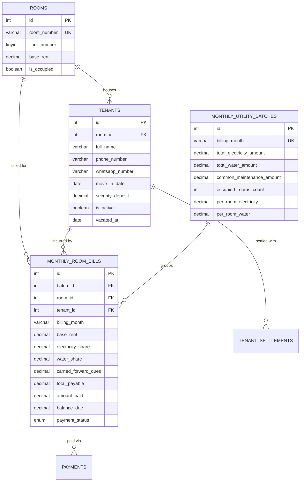

# 🏢 AeroRent: Rental & Tenant Expense Management System
### Specifically Engineered for Properties with 7 Rooms Across 2 Floors (Apple/macOS Glassmorphism Edition)

A full-stack, enterprise-grade rental and utility expense management platform designed for landlords and property managers. Tailored specifically for a two-floor building featuring **7 rooms with individualized fixed rents**, **automated equal-split utility distribution**, **real-time ledger tracking**, **instant WhatsApp payment reminder integration**, and a **one-click tenant vacating/deposit settlement workflow**.

---

## 🎨 Design Philosophy: Apple "Liquid Glass" (Glassmorphism)
The user interface draws inspiration from **macOS Sequoia / iOS 18 translucent glass aesthetics**:
- **Frosted Acrylic Glass Panels**: Dynamic backdrop blurs (`backdrop-blur-2xl`), specular highlights (`inset 0 1px 0 rgba(255,255,255,0.2)`), and translucent obsidian mesh gradients.
- **Micro-Animations & Responsive State**: Interactive hover lifts, luminous glowing borders for pending dues, and real-time calculation previews.
- **Typography & Clean Data Presentation**: Ultra-legible typography styled with clean Indian Rupee (`₹`) formatting.

---

## 🏗️ Architecture & Technology Stack

| Layer | Technology | Rationale |
| :--- | :--- | :--- |
| **Frontend** | **React 18 + Vite + Tailwind CSS** | Ultra-fast client-side reactivity, instant Hot Module Reloading (HMR), and high-fidelity custom glassmorphism design tokens. |
| **Authentication** | **JWT (JSON Web Tokens) + Bcrypt** | Secure password hashing, tamper-proof session tokens, role-based protection (Admin / Manager). |
| **Backend** | **Node.js + Express** | High-throughput asynchronous REST API with modular controllers, request logging, and transaction middleware. |
| **Database** | **MySQL 8.0+ (`mysql2/promise`)** | ACID-compliant relational transactions, foreign key constraints, generated stored columns (`balance_due`), and strict ledger consistency. |
| **Communication** | **WhatsApp Click-to-Chat API** | Direct zero-friction payment reminder dispatch via `https://wa.me/` with dynamic multi-line itemized invoice templates. |
| **Reporting** | **CSV/Excel Export & Print-to-PDF** | One-click spreadsheet generation with UTF-8 BOM encoding for Excel, plus print-ready ledger statements. |


---

## 🗄️ Relational Database Schema (`MySQL`)

The database is normalized to ensure ledger accuracy, prevent orphan records, and maintain historical audit trails.



### Static Room Configuration Seed
- **1st Floor (4 Rooms)**:
  - `Room 101`: Deluxe Balcony — **₹8,500 / month**
  - `Room 102`: Standard Attached Bath — **₹7,500 / month**
  - `Room 103`: Master Bedroom Suite — **₹9,000 / month**
  - `Room 104`: Compact Single — **₹7,000 / month**
- **2nd Floor (3 Rooms)**:
  - `Room 201`: Terrace Penthouse Suite — **₹10,500 / month**
  - `Room 202`: Double Bed Attached — **₹8,000 / month**
  - `Room 203`: East Sun Facing Corner — **₹8,500 / month**

---

## ⚡ Core Features & Workflows

### 1. Automated Utility & Expense Split Engine
- **Master Entry**: Landlord enters total building electricity bill (e.g., ₹3,900), total water bill (e.g., ₹1,600), and optional maintenance expenses (e.g., ₹1,000).
- **Equal Split Calculation**:
  $$\text{Per Room Utility Share} = \frac{\text{Total Electricity} + \text{Total Water} + \text{Maintenance}}{\text{Occupied Rooms Count}}$$
- **Ledger Generation**:
  $$\text{Final Payable} = \text{Fixed Base Rent} + \text{Electricity Share} + \text{Water Share} + \text{Past Arrears}$$
- **ACID Transaction**: Automatically generates records in `monthly_room_bills` in a single MySQL transaction. If any calculation fails, changes are cleanly rolled back.

### 2. WhatsApp Click-to-Chat Dynamic Reminder
Each room with pending dues features a 1-click **"Reminder"** button that compiles an itemized invoice and opens WhatsApp:
```text
🏢 *RENT & UTILITY BILL REMINDER*
━━━━━━━━━━━━━━━━━━━━
Hello *Priya Patel*,
Here is your monthly invoice summary for *Room 102* (2026-10):

🏠 *Monthly Rent:* ₹7,500
⚡ *Electricity Share:* ₹780
💧 *Water Bill Share:* ₹320
🧹 *Common Maintenance:* ₹200
⚠️ *Previous Pending Dues:* ₹1,500
━━━━━━━━━━━━━━━━━━━━
💰 *Total Balance Due: ₹6,300*
📅 *Due Date:* 2026-10-07

📲 *Quick UPI Payment:* `milanjaviya971-3@okaxis`
Please share the transaction screenshot after payment.
Thank you for your cooperation! 🙏
```

### 3. Tenant Vacating & Security Deposit Settlement Workflow
When a tenant vacates:
1. Calculates: $\text{Net Refundable} = \text{Security Deposit Held} - \text{Total Unpaid Dues} - \text{Damage Deductions}$
2. Marks all pending bills as settled through deposit deduction.
3. Sets tenant to inactive (`is_active = FALSE`, `vacated_at = CURRENT_DATE`).
4. **Instantly clears the room** (`is_occupied = FALSE`), making it available for a new tenant entry immediately.

---

## 🚀 Getting Started

### 1. Database Setup (MySQL)
1. Open MySQL workbench or command line:
   ```bash
   mysql -u root -p < database/schema.sql
   ```
2. Verify tables and 7-room seed data have been inserted.

### 2. Backend Setup
1. Navigate to the backend folder:
   ```bash
   cd backend
   npm install
   ```
2. Configure `.env`:
   ```env
   PORT=5000
   DB_HOST=localhost
   DB_USER=root
   DB_PASSWORD=your_password
   DB_NAME=rental_management
   DB_PORT=3306
   ```
3. Start the Express server:
   ```bash
   npm run dev
   # Server runs at http://localhost:5000/api
   ```

### 3. Frontend Setup
1. Navigate to the frontend directory:
   ```bash
   cd frontend
   npm install
   npm run dev
   # Dashboard runs at http://localhost:3000
   ```
2. If the backend is not yet started, the frontend automatically runs in **Offline Demo Mode** with complete mock state so you can test all UI interactions immediately!
